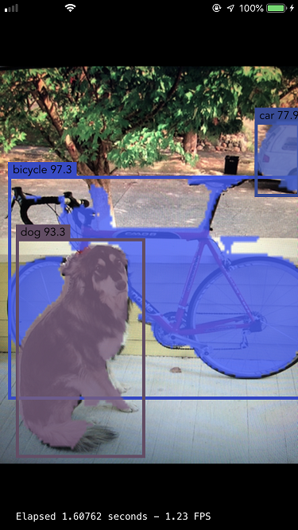

# Yolact-CoreML

An example of [You Only Look At CoefficienTs](https://github.com/dbolya/yolact) on iOS using CoreML.

## About Yolact

[Yolact](https://github.com/dbolya/yolact) [(https://github.com/dbolya/yolact)](https://github.com/dbolya/yolact) is a simple, fully convolutional model for real-time instance segmentation. [https://arxiv.org/abs/1904.02689](https://arxiv.org/abs/1904.02689)

## Code references
- UI code: [YOLO-CoreML-MPSNNGraph](https://github.com/hollance/YOLO-CoreML-MPSNNGraph) [(https://github.com/hollance/YOLO-CoreML-MPSNNGraph)](https://github.com/hollance/YOLO-CoreML-MPSNNGraph)

## Environment

onnx                   1.4.1

onnx-coreml            0.4.0

onnx-simplifier        0.1.8

torch                  1.0.1

## Usage

How to convert pytorch model to CoreML model:

1. Run [yolcat code with ONNX and CoreML converter](https://github.com/Ma-Dan/yolact/tree/coreml) to convert to ONNX model (WITHOUT priors layer).

2. Use onnx-simplifier to simplify ONNX model.

3. Disable Upsample layer in onnx-coreml package to make Upsample custom layer in CoreML.

4. Run [ONNXToCoreML converter](https://github.com/Ma-Dan/yolact/blob/coreml/onnx_to_coreml.py) to conver ONNX mode to CoreML model, input should be MLMultiArray (3x550x550) and we need to do input normalization in our application code.

## Todo

1. Simply model to get more performance on mobile devices.
